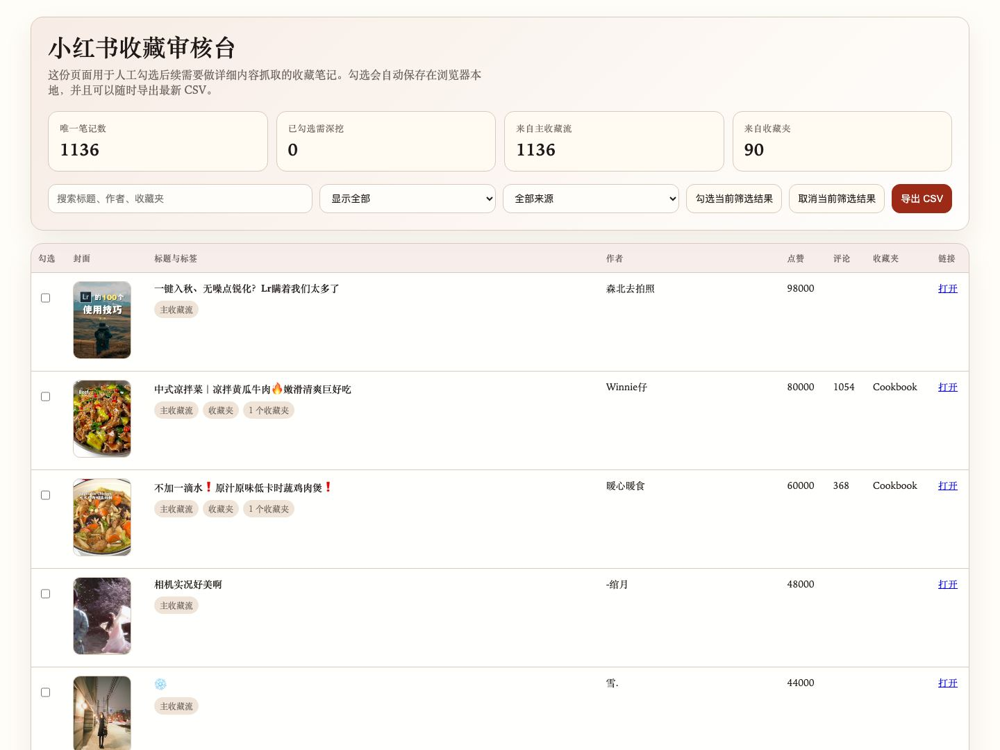

# xhs-favorites

[](https://www.npmjs.com/package/xhs-favorites)
[](https://www.npmjs.com/package/xhs-favorites)
[](https://github.com/ONEMULE/xhs-favorites/releases/latest)
[](https://github.com/ONEMULE/xhs-favorites/actions/workflows/ci.yml)
[](https://github.com/ONEMULE/xhs-favorites/blob/main/LICENSE)

Persistent-profile XiaoHongShu tooling with unified CLI + MCP access.

`xhs-favorites` is a self-hosted XiaoHongShu toolkit with two internal execution modes:

- `api`
  Lightweight public-state extraction for read flows when page HTML already contains usable state.
- `playwright`
  Persistent-profile browser automation for authenticated and high-fidelity flows.

It has two public entrypoints:

- `xhs-favorites`
  CLI for login, diagnostics, reading favorites, and exporting a review bundle.
- `xhs-favorites-mcp`
  MCP server exposing the same capabilities over stdio for Codex or other MCP clients.

## Install from npm

```bash
npm install -g xhs-favorites
xhs-favorites --version
```

## Fast Start

```bash
xhs-favorites bootstrap --client codex --pretty
xhs-favorites login
xhs-favorites doctor --pretty
xhs-favorites list-notes --limit 10 --pretty
```

If you want to wire it into an MCP client, use `xhs-favorites-mcp` as the command. This binary is meant to be launched by an MCP client over stdio. It is not an interactive shell command.

### Codex MCP snippet

```toml
[mcp_servers.xhs_favorites]
command = "xhs-favorites-mcp"
args = []
```

### Claude Desktop MCP snippet

```json
{
  "mcpServers": {
    "xhs-favorites": {
      "command": "xhs-favorites-mcp",
      "args": []
    }
  }
}
```

## Screenshots

Review bundle HTML:



## Project Links

- npm: https://www.npmjs.com/package/xhs-favorites
- GitHub: https://github.com/ONEMULE/xhs-favorites
- Release notes: https://github.com/ONEMULE/xhs-favorites/releases/latest
- Issues: https://github.com/ONEMULE/xhs-favorites/issues
- Install guide: https://github.com/ONEMULE/xhs-favorites/blob/main/docs/install.md
- Capability matrix: https://github.com/ONEMULE/xhs-favorites/blob/main/docs/capabilities.md
- Codex setup guide: https://github.com/ONEMULE/xhs-favorites/blob/main/docs/codex.md
- Claude Desktop setup guide: https://github.com/ONEMULE/xhs-favorites/blob/main/docs/claude-desktop.md
- Troubleshooting guide: https://github.com/ONEMULE/xhs-favorites/blob/main/docs/troubleshooting.md
- FAQ: https://github.com/ONEMULE/xhs-favorites/blob/main/docs/faq.md
- Release guide: https://github.com/ONEMULE/xhs-favorites/blob/main/docs/releasing.md

## What It Provides

- Dedicated persistent browser profile
  The tool keeps a separate Playwright user data directory and does not depend on ad-hoc cookie files as the primary auth path.
- Dual-provider routing
  Commands can route to API extraction or browser automation depending on capability requirements.
- Home feed listing
  Reads the recommendation feed.
- Search
  Searches notes through the authenticated browser route when the public page does not expose usable state.
- Saved notes listing
  Reads your main favorites feed.
- Favorite boards listing
  Reads your saved boards / collections.
- Board item listing
  Reads notes inside a specific board.
- User notes listing
  Reads a public user note list when available.
- Unified note detail reading
  Opens a specific note URL and extracts structured content through the unified router.
- Comment reading
  Reads comments and replies with browser fallback.
- Interaction tools
  Supports like / unlike, favorite / unfavorite, post comment, and reply comment.
- Publishing entrypoints
  Supports image-note and video-note publishing through the self-hosted browser route.
- Creator center data entrypoints
  Exposes dashboard, content metrics, and fan metrics collectors.
- Diagnostics
  Detects `authenticated`, `auth_required`, and `risk_controlled` states.
- Review bundle export
  Produces CSV + JSON + HTML for manual review and follow-up detail selection.

## Requirements

- Node.js `>=20`
- npm
- A machine that can open a real browser for the first login
- Network access to XiaoHongShu

## Install

### Install from npm

This is the primary distribution path:

```bash
npm install -g xhs-favorites
xhs-favorites bootstrap --client codex --pretty
```

After install, the commands should be available globally:

```bash
xhs-favorites --version
xhs-favorites --help
which xhs-favorites-mcp
```

`xhs-favorites-mcp` is the MCP server entrypoint. It is expected to be launched by Codex, Claude Desktop, or another MCP client, not run manually in a normal terminal session.

### Local clone

```bash
git clone git@github.com:ONEMULE/xhs-favorites.git
cd xhs-favorites
npm install
node ./src/cli.js bootstrap --client codex --pretty
```

### Global install from GitHub

If you want to use the latest GitHub version directly:

```bash
npm install -g github:ONEMULE/xhs-favorites
```

## Session Model

The dedicated Playwright profile lives under:

```text
~/.mcp/xhs-favorites/profile
```

This matters because:

- first login is manual
- later commands reuse the same browser profile
- the tool can survive process restarts without requiring a fresh cookie import every time

## Quick Start

```bash
xhs-favorites bootstrap --client codex --pretty
xhs-favorites login
xhs-favorites doctor --pretty
xhs-favorites list-notes --limit 10 --pretty
```

The `login` command opens a real browser using the official Playwright CLI. After you finish logging into XiaoHongShu and close that browser window, the profile is persisted and later commands can reuse it.

## CLI Commands

### `login`

Open a real browser and persist the session into the dedicated Playwright profile.

```bash
xhs-favorites login
xhs-favorites login --channel chrome
```

### `doctor`

Check whether the profile is logged in, blocked by risk control, or missing authentication.

```bash
xhs-favorites doctor --pretty
xhs-favorites doctor --headless --pretty
```

Typical result:

```json
{
  "ok": true,
  "profile_dir_exists": true,
  "login_state": "authenticated",
  "page_url": "https://www.xiaohongshu.com/explore",
  "page_title": "小红书 - 你的生活兴趣社区",
  "profile_id": "6707b784000000001d0236fa"
}
```

### `doctor-full`

Return auth state plus the provider capability matrix.

```bash
xhs-favorites doctor-full --headless --pretty
```

### `home-feed`

Read the recommendation feed.

```bash
xhs-favorites home-feed --limit 10 --pretty
```

### `search-notes`

Search XiaoHongShu content.

```bash
xhs-favorites search-notes --keyword AI工具 --limit 10 --pretty
```

### `list-notes`

Read the main favorites feed.

```bash
xhs-favorites list-notes --limit 10 --pretty
xhs-favorites list-notes --headless --limit 50 --scroll 80 --pretty
```

### `list-boards`

Read favorite boards.

```bash
xhs-favorites list-boards --pretty
```

### `list-board-items`

Read notes inside a specific board.

```bash
xhs-favorites list-board-items --board-id 683f2dd7000000002300522c --limit 20 --pretty
xhs-favorites list-board-items --url "https://www.xiaohongshu.com/board/<board_id>" --pretty
```

### `note-detail`

Read one note in detail using an authenticated session.

```bash
xhs-favorites note-detail --url "https://www.xiaohongshu.com/discovery/item/<note_id>?xsec_token=..." --pretty
xhs-favorites note-detail --note-id <note_id> --xsec-token <token> --pretty
```

### `note-comments`

Read note comments and replies.

```bash
xhs-favorites note-comments --url "<note_url>" --limit 20 --pretty
```

### `list-user-notes`

Read a user profile note list.

```bash
xhs-favorites list-user-notes --url "https://www.xiaohongshu.com/user/profile/<profile_id>" --limit 20 --pretty
```

### Interaction

```bash
xhs-favorites like-note --url "<note_url>" --pretty
xhs-favorites favorite-note --url "<note_url>" --pretty
xhs-favorites post-comment --url "<note_url>" --content "写得很好" --pretty
xhs-favorites reply-comment --url "<note_url>" --comment-id "<comment_id>" --content "收到" --pretty
```

### Publishing

```bash
xhs-favorites publish-note \
  --title "今日分享" \
  --content "正文内容" \
  --image "/absolute/path/to/image.jpg" \
  --visibility "仅自己可见" \
  --pretty

xhs-favorites publish-video \
  --title "视频标题" \
  --content "视频正文" \
  --video "/absolute/path/to/video.mp4" \
  --visibility "仅自己可见" \
  --pretty
```

### Creator Data

```bash
xhs-favorites creator-dashboard --pretty
xhs-favorites creator-content-metrics --limit 20 --pretty
xhs-favorites creator-fan-metrics --pretty
```

### `export-review`

Export a review bundle for large-scale manual triage.

```bash
xhs-favorites export-review --headless --pretty
```

This command writes:

- `favorites_review.csv`
- `favorites_review.json`
- `favorites_review.html`
- `favorites_review_summary.json`

The HTML file provides:

- searchable review table
- real checkboxes
- local selection persistence in the browser
- export of an updated CSV with the current selections

## Output Files

By default, export bundles are written under:

```text
~/.mcp/xhs-favorites/exports/<timestamp>/
```

Typical files:

- `favorites_review.csv`
  Flat review sheet with note metadata and selection columns.
- `favorites_review.html`
  Interactive review page for manually selecting notes worth deeper extraction.
- `favorites_review.json`
  Full structured export.
- `favorites_review_summary.json`
  Short metadata summary.

## MCP Wiring

### Codex configuration

Add this to `~/.codex/config.toml`:

```toml
[mcp_servers.xhs_favorites]
command = "xhs-favorites-mcp"
args = []
```

Then restart or reload your Codex client session if needed.

### Claude Desktop configuration

Add this to your Claude Desktop MCP config:

- macOS:
  `~/Library/Application Support/Claude/claude_desktop_config.json`
- Windows:
  `%APPDATA%\\Claude\\claude_desktop_config.json`

Example:

```json
{
  "mcpServers": {
    "xhs-favorites": {
      "command": "xhs-favorites-mcp",
      "args": []
    }
  }
}
```

Then fully restart Claude Desktop.

### MCP install troubleshooting

If your MCP client cannot find `xhs-favorites-mcp`, use an absolute command path instead of relying on `PATH`.

You can discover the path with:

```bash
which xhs-favorites-mcp
```

Then use that full path in your client config.

### Exposed MCP tools

- `login`
- `doctor`
- `list_saved_notes`
- `list_saved_boards`
- `list_board_items`
- `get_saved_note_detail`

## Troubleshooting

### `AUTH_REQUIRED`

This means the dedicated profile is not logged in or the session expired.

Fix:

```bash
xhs-favorites login
```

### `RISK_CONTROLLED`

XiaoHongShu is showing a risk-control or verification page.

Typical fixes:

- switch to a safer network
- use the visible browser flow instead of headless
- complete the requested verification in the dedicated profile
- avoid repeated full-history scraping in a short period

### `SELECTOR_CHANGED`

The front-end state shape or DOM path likely changed.

This tool intentionally prefers `window.__INITIAL_STATE__` where possible, but XiaoHongShu can still change the page structure. Re-check:

- favorites list state
- board list state
- board feed state
- note detail state

### SSH push hangs but HTTPS works

If `git push` over SSH times out, but `gh` still works, the problem is usually the machine's SSH path to GitHub rather than the repository itself.

For a fuller troubleshooting guide, see [docs/troubleshooting.md](./docs/troubleshooting.md).

## Distribution Status

The project is already available through all three primary public entrypoints:

- npm package:
  `https://www.npmjs.com/package/xhs-favorites`
- GitHub repository:
  `https://github.com/ONEMULE/xhs-favorites`
- GitHub release:
  `https://github.com/ONEMULE/xhs-favorites/releases/tag/v0.1.0`

For most users, npm is the recommended install path:

```bash
npm install -g xhs-favorites
```

## Development

```bash
npm test
npm run release:check
```

See also:

- [CHANGELOG.md](https://github.com/ONEMULE/xhs-favorites/blob/main/CHANGELOG.md)
- [CONTRIBUTING.md](https://github.com/ONEMULE/xhs-favorites/blob/main/CONTRIBUTING.md)
- [SECURITY.md](https://github.com/ONEMULE/xhs-favorites/blob/main/SECURITY.md)
- [CODE_OF_CONDUCT.md](https://github.com/ONEMULE/xhs-favorites/blob/main/CODE_OF_CONDUCT.md)
